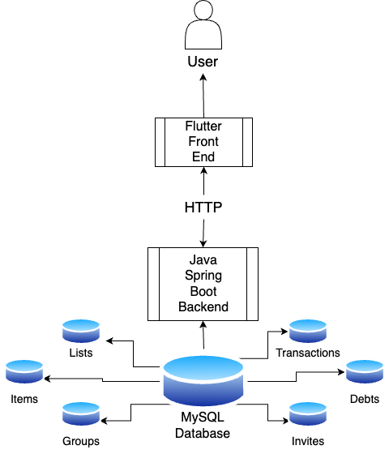
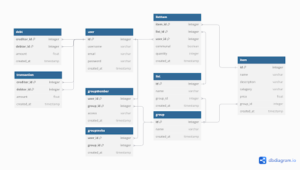
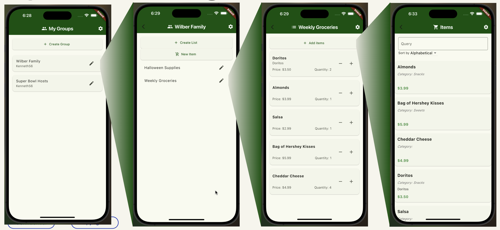

# ShareCart

## Project Description
ShareCart is an innovative mobile application designed to revolutionize the way groups manage their shopping needs. At its core, ShareCart serves as a digital platform that enables seamless collaboration between users when creating and managing shopping lists. The application is built using Flutter, providing a cross-platform solution that works on both iOS and Android devices. ShareCart addresses a common pain point in shared living situations: the coordination of shopping responsibilities and the management of household supplies. Whether it's roommates sharing an apartment, families managing their grocery needs, or friends planning a group shopping trip, ShareCart provides an intuitive solution to keep everyone on the same page.

The application features a robust user authentication system, allowing individuals to create personal accounts and manage their shopping preferences. Users can form groups with others, creating a shared space for collaborative shopping lists. Each group can maintain multiple lists, with real-time updates ensuring all members stay informed about changes. The interface is designed with simplicity in mind, featuring a clean, modern design that makes it easy for users of all technical backgrounds to navigate and use the application effectively. The app includes essential features such as item search functionality, list sharing capabilities, and settings management, all wrapped in an intuitive user interface that prioritizes ease of use.

## Architecture

### Architecture Diagram


### Database Schema


### Front End Preview


### Dependencies
#### Frontend
Flutter Dependencies:
- `provider ^6.1.2`
- `cupertino_icons ^1.0.8`
- `fetch_client ^1.1.2`
- `http ^1.3.0`
- `flutter_secure_storage ^9.2.4`

Flutter Testing Dependencies:
- `mockito ^5.4.5`
- `build_runner ^2.4.15`
- `flutter_lints ^5.0.0`
- `test ^1.25.8`

#### Backend
Spring Boot Dependencies:
- `org.springframework.boot:spring-boot-starter-data-jpa`
- `org.springframework.boot:spring-boot-docker-compose`
- `org.springframework.boot:spring-boot-starter-security`
- `org.springframework.boot:spring-boot-starter-web`
- `org.springframework.boot:spring-boot-starter-validation`
- `com.auth0:java-jwt:4.4.0`
- `org.projectlombok:lombok`
- `com.mysql:mysql-connector-j`
- `org.springframework.boot:spring-boot-starter-actuator`
- `org.springframework.boot:spring-boot-starter-test`
- `org.springframework.boot:spring-boot-testcontainers`
- `org.testcontainers:junit-jupiter`
- `org.testcontainers:mysql`
- `org.springframework.security:spring-security-test`
- `org.junit.platform:junit-platform-launcher`
- `jakarta.persistence:jakarta.persistence-api:3.1.0`

## Startup Guide

The following guide assumes you use VSCode as your IDE.

### Prerequisites
- Install Java 21.0.7
- Install Dart development packages
- Install Docker
- Install VSCode and the Flutter VSCode extension
- Install Gradle for Java

### Starting the Back End
Ensure that Docker is running, as Gradle will create the mysql container automatically.
```bash
cd SpringBoot/cart
./gradlew bootRun # (if you're on Windows, use gradlew.bat instead)
```

### Starting the Front End
- Make sure you're using VSCode and the Flutter VSCode extension is enabled
- Open up the `share_cart_flutter/lib/main.dart` file and click the run button in the top right.

### Running Front End Tests
TODO

### Running Back End Tests
To run JUnit Tests:
```bash
cd SpringBoot/cart
./gradlew test
```
Note: Some tests will fail, as implementations changed after these tests were written, however they were kept for the sake of posterity.

To run Postman Tests:
1. Follow above steps to start the backend
2. Import `SWE Environment.postman_environment.json` into Postman
3. Import `SWE Testing.postman_collection.json` into Postman
4. Set the Environment in the SWE Testing collection to SWE Environment.
4. In the SWE Testing collection, execute the `Sign Up` request with a unique username, email, and password.
5. In the SWE Testing collection, execute the `Sign In` request with the username and password. Copy the returned token (without quotes) into the SWE Environment Variable titled `access_token`.
6. All other tests can now be executed.

### Generating Front End Documentation
```bash
cd share_cart_flutter
dart doc .
dart pub global activate dhttpd
dart pub global run dhttpd --path doc/api
```
Open `localhost:8080` in any web browser.

### Generating Back End Documentation
```bash
cd SpringBoot/cart
./gradlew javadoc # (if you're on Windows, use gradlew.bat instead)
```
Open `SpringBoot/cart/build/docs/javadoc/index.html` in your web browser.

## Usage Guide
ShareCart is designed to be accessible to users of all technical backgrounds. To begin using the application, new users must first create an account through the sign-up process. This involves providing basic information such as a username, email address, and password. Once registered, users can immediately start creating groups and shopping lists. The application's main interface is divided into four key sections: Home, Group, Search, and Settings, each accessible through a bottom navigation bar.

The Home section serves as the primary dashboard where users can view and manage their active shopping lists. Here, users can create new lists, add items, and track the status of their shopping needs. The Group section allows users to create and manage their shopping groups, inviting other users to collaborate on shared lists. The Search functionality enables users to quickly find specific items across their lists, while the Settings section provides options for customizing the application to individual preferences.

For example, consider a typical use case: a group of college students sharing an apartment. One student might create a "Kitchen Supplies" group and invite their roommates to join. Together, they can maintain a shared grocery list where each person can add items they need. When someone goes shopping, they can mark items as purchased, and all group members will see the updates in real-time. This eliminates the need for multiple lists or miscommunication about what has been bought and what still needs to be purchased.

## Folder Structure Overview

- `imgs` - Images for this README.
- `share_cart_flutter` - Flutter (front end) application root directory.
    - `doc` - Documentation.
    - `lib` - Application UI files.
        - `providers` - Provider files (providers are a data sharing construct specific to Flutter).
        - `pages` - Page files.
        - `common` - UI elements and types shared across the pages.
        - `main.dart` - The main dart file which is the entrypoint for the application.
    - `test` - Unit tests.
- `SpringBoot` - SpringBoot (back end) application root directory.
    - `cart` - Spring Boot generated package directory.
        - `gradle` 
            - `wrapper` - Gradle jar file directory.
        - `src` - Source code directory
            - `main` - Primary source code
                -  `java\org\swe\cart`- Backend end Java source directory where primary application is located
                    - `configs` - Configuration files
                    - `controllers` - REST Controller Java files
                    - `embeddables` - Embeddable ID definitions
                    - `entities` - Database Entity definitions
                    - `exceptions` - Custom Exception Type definitions
                    - `payload` - Data Transfer Object definitions
                    - `repositories` - JPA Repository interface declarations
                    - `security` - User Authentication system definitions
                    - `services` - Backend services
                -   `resources` - Application properties directory for Spring Boot
            - `test` - Test source code
                - `java\org\swe\cart` - Java tests
                - `postman` - Manually performed Postman tests saved in JSON

## Tech Stack

### Architecture Diagram


As illustrated by the above diagram, our application consists for three main dependencies:
- Flutter
    - Used to create the front end UI.
- SpringBoot
    - Used to handle database-client networking and wrap the MySQL database.
- MySQL database
    - Used to store client information.

## Contributions

### Jonah
- Database schema design
- Backend security
- Group and User backend endpoints
- Frontend API integration

### Jonathan
- Initial App UI Design 
- Sign up page
- Documentation 

### Jeremy
- Database schema design
- Frontend creation dialogs
- List and Item backend endpoints

### Kenneth
- App Layout Design
- Assorted UI Elements
- Shop Page
- Front end testing

## Development Retrospective
Our development roadblocks manifested in three primary points:
1. Concurrent development of the front and backends lead to conflicting design ideologies that were difficult to merge.
2. Poor communication often led to confusion and delays in implementation.
3. Poor understanding of development frameworks led to team members spending time trying to make suboptimal solutions work, when there were better options available.

Potential solutions could be:
1. Spending more time in the early design stage to define server-client interactions more thoroughly could have allowed the front and back end teams to work independently without resulting in diverging implementations.
2. Sticking to planned meeting times, and making better use of organizational tools such as Trello.
3. This issue was inevitable, given that no members of the team were familiar with the tools used, and as the project progressed understanding improved. Doing more research could have been helpful making this process faster.

## License
This project is licensed under the MIT License, a permissive free software license that places minimal restrictions on how the software can be used, modified, and distributed. The MIT License allows for commercial use, modification, distribution, and private use of the software.
